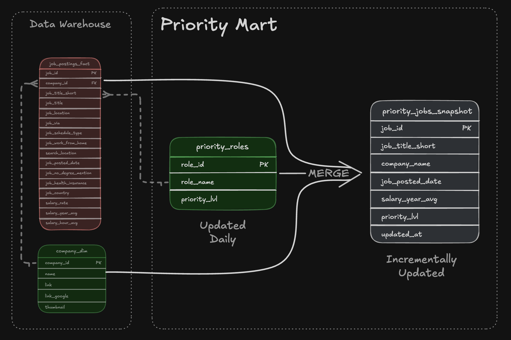

# 🏢 Data Warehouse & Analytical Marts: End-to-End Production ETL

A complete data engineering pipeline that ingests raw CSV datasets from Google Cloud Storage, transforms them into a structured star-schema data warehouse, and builds optimized analytical data marts for reporting and business intelligence.


---

## 📌 Executive Overview (For Recruiters & Hiring Managers)

- ✅ **End-to-end pipeline:** Designed and implemented a full ETL workflow—from raw cloud files to warehouse and downstream marts
- ✅ **Dimensional modeling:** Engineered a robust star schema including fact, dimension, and bridge tables
- ✅ **Production ETL patterns:** Built idempotent data loads with transformation logic and validation checks
- ✅ **Analytics optimization:** Developed purpose-built marts (flat, skills, priority, company) with additive metrics and incremental refresh logic

---

## 🎯 Business Context

Job posting datasets are delivered as raw CSV files stored in Google Cloud Storage. Although rich in information, these flat files are not structured for scalable analytical workloads.

Business stakeholders require answers to questions such as:

- Which technical skills are trending over time?
- How are hiring patterns evolving by company and geography?
- What salary patterns emerge across roles and skill combinations?

### The Challenge

Flat files alone cannot support consistent enterprise analytics. A centralized warehouse system is required to:

- Standardize transformations
- Normalize relationships
- Provide a single source of truth
- Improve query performance for recurring analytical patterns

### The Solution

This project introduces:

1. A cloud-to-warehouse ETL pipeline
2. A normalized star schema data warehouse
3. Multiple analytical marts tailored to specific reporting needs

The outcome is a production-style pipeline that supports both flexible exploration and optimized business reporting.

---

## 🛠️ Technology Stack

- 🐥 **Database:** DuckDB (OLAP engine with `httpfs` support for GCS access)
- 🧾 **Language:** SQL (DDL + DML for modeling and transformations)
- 📐 **Data Model:** Star schema (fact + dimension + bridge tables)
- 💻 **Development:** VS Code + DuckDB CLI
- ⚙️ **Orchestration:** Master SQL execution script
- 🌐 **Source Storage:** Google Cloud Storage
- 📦 **Version Control:** Git & GitHub

---

## 📁 Repository Structure

```text
2_WH_Mart_Build/
├── 01_create_tables_dw.sql         # Data warehouse schema creation
├── 02_load_schema_dw.sql           # Extract & load from GCS
├── 03_create_flat_mart.sql         # Fully denormalized reporting mart
├── 04_create_skills_mart.sql       # Time-series skill demand mart
├── 05_create_priority_mart.sql     # Initial priority mart build
├── 06_update_priority_mart.sql     # Incremental MERGE updates
├── 07_create_company_mart.sql      # Company trends mart (optional)
├── build_dw_marts.sql              # End-to-end pipeline executor
└── README.md # Documentation
```

---

# 🏗️ Architecture Overview


### Workflow

1. Load raw CSV files from Google Cloud Storage
2. Normalize data into a dimensional warehouse
3. Build downstream marts optimized for reporting
4. Enable BI tools (Excel, Power BI, Tableau, Python) to query warehouse or marts

---

# 🏛️ Data Warehouse Layer

The warehouse follows a star schema design:

- `job_postings_fact`
- `company_dim`
- `skills_dim`
- `skills_job_dim` (bridge table)


### SQL Components

- [`01_create_tables_dw.sql`](./01_create_tables_dw.sql) → Creates core tables
- [`02_load_schema_dw.sql`](./02_load_schema_dw.sql) → Loads and transforms GCS CSV data

### Design Characteristics

- Serves as the authoritative analytical layer
- Fact table grain: one record per job posting
- Dimensions store descriptive business attributes
- Bridge tables manage many-to-many skill relationships

---

# 📊 Flat Reporting Mart


### Purpose

Provides a fully denormalized dataset for straightforward ad-hoc analysis.

### Grain

One row per job posting with all dimensions joined.

### Script

- [`03_create_flat_mart.sql`](./03_create_flat_mart.sql)

---

# 📈 Skills Demand Mart


### Purpose

Supports time-series analysis of skill demand.

### Grain

`skill_id + month_start_date + job_title_short`

### Script

- [`04_create_skills_mart.sql`](./04_create_skills_mart.sql)

### Design Principles

- Uses additive measures (counts and sums)
- Safe for re-aggregation at higher levels
- Time-based modeling via `DATE_TRUNC('month')`

---

# 🚨 Priority Roles Mart



### Purpose

Tracks priority job roles with incremental updates.

### Scripts

- [`05_create_priority_mart.sql`](./05_create_priority_mart.sql) – Initial snapshot build
- [`06_update_priority_mart.sql`](./06_update_priority_mart.sql) – Incremental updates using `MERGE`

### Key Features

- Production-style upsert logic
- Uses:
  - `WHEN MATCHED`
  - `WHEN NOT MATCHED`
  - `WHEN NOT MATCHED BY SOURCE`
- Supports INSERT, UPDATE, and DELETE within a single statement
- Grain: one row per job posting with assigned priority level

---

# 🏢 Company Trends Mart


### Purpose

Analyzes hiring patterns by:

- Company
- Role
- Location
- Month

### Grain

`company_id + job_title_short_id + location_id + month_start_date`

### Script

- [`07_create_company_mart.sql`](./07_create_company_mart.sql)

### Advanced Concepts

- Bridge tables for complex relationships
- Hierarchical job title mappings
- Optional build depending on business needs

---

# 💡 Data Engineering Capabilities Demonstrated

## 🔄 ETL Engineering

- Direct CSV ingestion from GCS using DuckDB `httpfs`
- Data cleansing and normalization
- Explicit type casting and schema enforcement
- Idempotent scripts using `DROP TABLE IF EXISTS`
- Incremental loads via `MERGE`
- Automated execution through master SQL script

---

## 📐 Dimensional Modeling

- Fact-to-dimension separation
- Many-to-many relationship handling via bridge tables
- Clearly defined table grain
- Additive metric design
- Surrogate key generation (CTE-based approach in advanced mart builds)

---

## 🧠 Advanced SQL Techniques

- Schema and table management (DDL)
- Structured data loading with `INSERT INTO ... SELECT`
- Incremental updates using `MERGE INTO`
- Complex transformations via CTEs
- Time dimension derivation (`DATE_TRUNC`, `EXTRACT`)
- String aggregation and cleansing
- Boolean normalization with `CASE WHEN`

---

## 🏭 Production-Ready Practices

- Fully rerunnable scripts (idempotent design)
- Logical schema separation (`flat_mart`, `skills_mart`, etc.)
- Validation queries embedded at pipeline stages
- Strict type definitions (`INTEGER`, `DOUBLE`, `BOOLEAN`, `TIMESTAMP`)
- Clear execution ordering via orchestration script
- Structured error handling and execution flow

---

# 🎯 Project Outcomes

This project demonstrates the ability to:

- Design scalable dimensional models
- Build production-grade ETL workflows
- Implement incremental refresh logic
- Apply advanced SQL engineering techniques
- Convert raw operational data into analytics-ready structures
