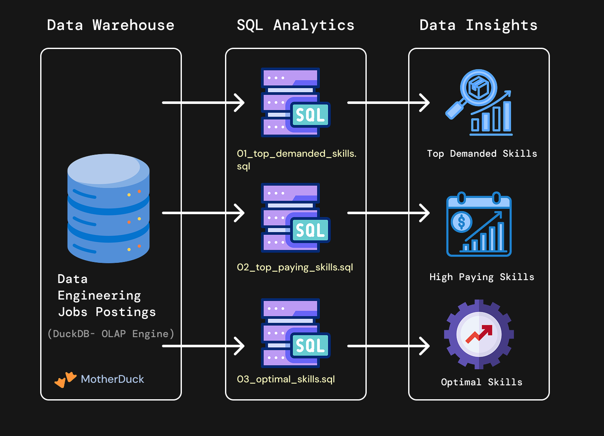

# Data Engineering Projects

Hands-on projects to reinforce core data engineering concepts from the SQL for Data Engineering course.

# Projects

## [1_EDA/](./1_EDA/) - Exploratory Data Analysis

SQL-driven analysis of data engineer job market trends using advanced querying techniques.

**Skills**: Complex joins, aggregations, analytical functions, data quality validation
