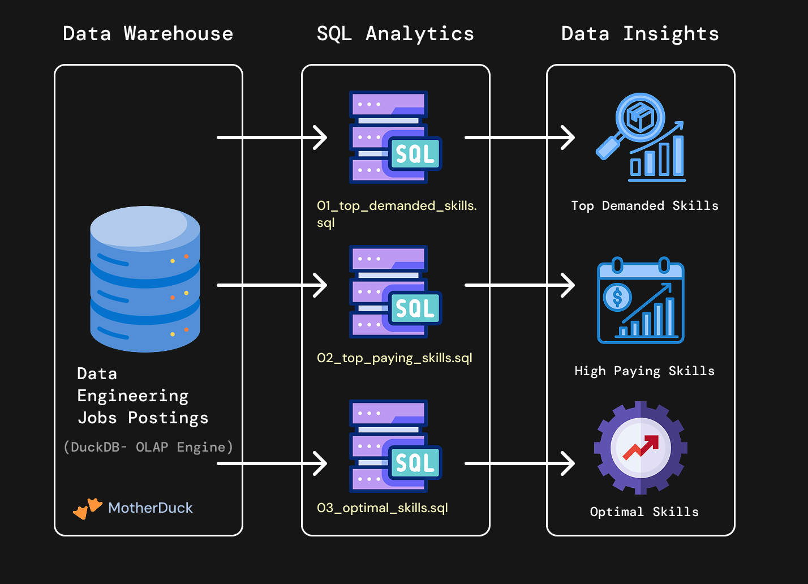
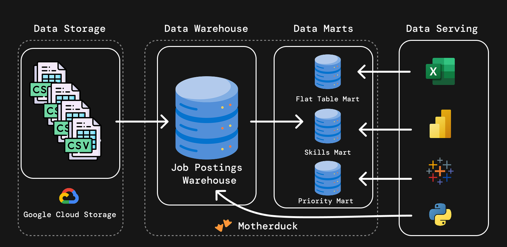

# 🚀 Data Engineering Projects Portfolio

Practical, hands-on projects designed to apply and strengthen core data engineering concepts learned from the **SQL for Data Engineering** course.

These projects focus on real-world data workflows, analytical querying, dimensional modeling, and production-style pipeline development.

---

# 📂 Projects Overview

---

## 📊 1_EDA/ – Exploratory Data Analysis

This project explores data engineer job market trends using advanced SQL techniques on a structured data warehouse.

The analysis focuses on extracting meaningful insights from job postings by leveraging multi-table joins, aggregations, and analytical functions.

### 🔍 What This Project Covers

- Skill demand analysis
- Salary trend evaluation
- Demand vs compensation optimization
- Real-world business question translation into SQL

### 🛠 Core Skills Demonstrated

- Complex `JOIN` operations across fact and dimension tables
- Aggregation functions (`COUNT`, `MEDIAN`, `GROUP BY`)
- Analytical and mathematical functions
- Data filtering and validation
- Query structuring using CTEs

---

## 🏗 2_WH_Mart_Build/ – Data Pipeline: Data Warehouse & Data Marts

An end-to-end ETL pipeline that ingests raw CSV data and transforms it into a structured star schema data warehouse, followed by analytical data marts optimized for reporting.

This project demonstrates production-oriented data modeling and pipeline engineering practices.

### 🔄 Pipeline Scope

- Extract raw CSV files
- Transform and normalize into dimensional tables
- Load into a star schema warehouse
- Build specialized analytical data marts

### 🧠 Architecture Highlights

- Fact and dimension table design
- Bridge tables for many-to-many relationships
- Granularity definition for accurate aggregation
- Incremental update patterns using `MERGE`

### 🛠 Core Skills Demonstrated

- Dimensional modeling (Star Schema)
- ETL pipeline development
- Data mart design
- Idempotent SQL scripting
- Production-grade practices

---

# 🎯 What These Projects Showcase

Together, these projects demonstrate the ability to:

- Translate business requirements into structured SQL solutions
- Design scalable analytical data models
- Build and orchestrate end-to-end data pipelines
- Apply production-ready engineering standards
- Deliver insight-driven outcomes from structured data

---

📌 These projects represent practical implementation of modern data engineering principles using SQL and analytical databases.

# 🙌 Attributions and Acknowledgements

These projects are inspired by Luke Barousse's [SQL Data Enginnering Projects](https://github.com/lukebarousse/SQL_Data_Engineering_Course).  
I have recreated and modified the project for learning purposes.

🖼️ The icons which are used to create the project

- <a href="https://www.flaticon.com/free-icons/database" title="database icons">Database icons created by Freepik - - Flaticon</a>
- <a href="https://www.flaticon.com/free-icons/sql" title="sql icons">Sql icons created by Freepik - Flaticon</a>
- <a href="https://www.flaticon.com/free-icons/product-research" title="product-research icons">Product-research - icons created by Uniconlabs - Flaticon</a>
- <a href="https://www.flaticon.com/free-icons/product-research" title="product research icons">Product research icons created by Uniconlabs - Flaticon</a>
- <a href="https://www.flaticon.com/free-icons/optimization" title="optimization icons">Optimization icons created by Freepik - Flaticon</a>
- <a href="https://www.flaticon.com/free-icons/csv" title="csv icons">Csv icons created by Freepik - Flaticon</a>
